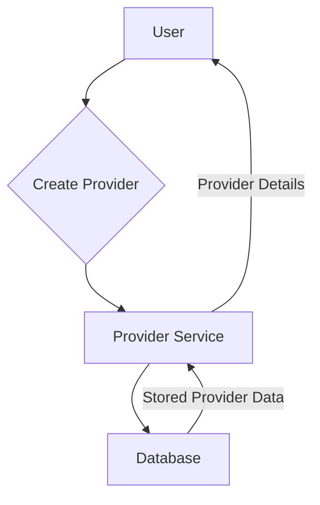
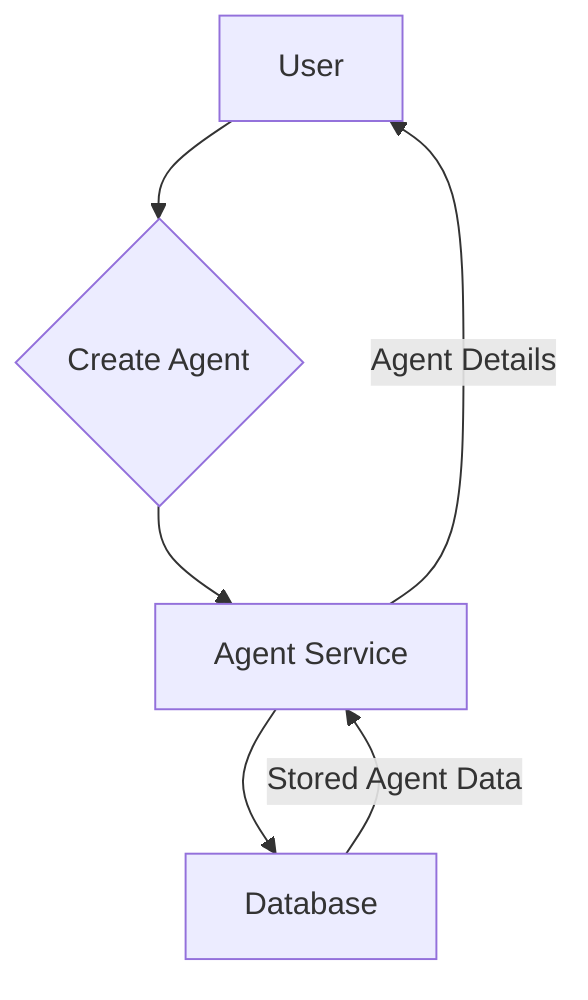
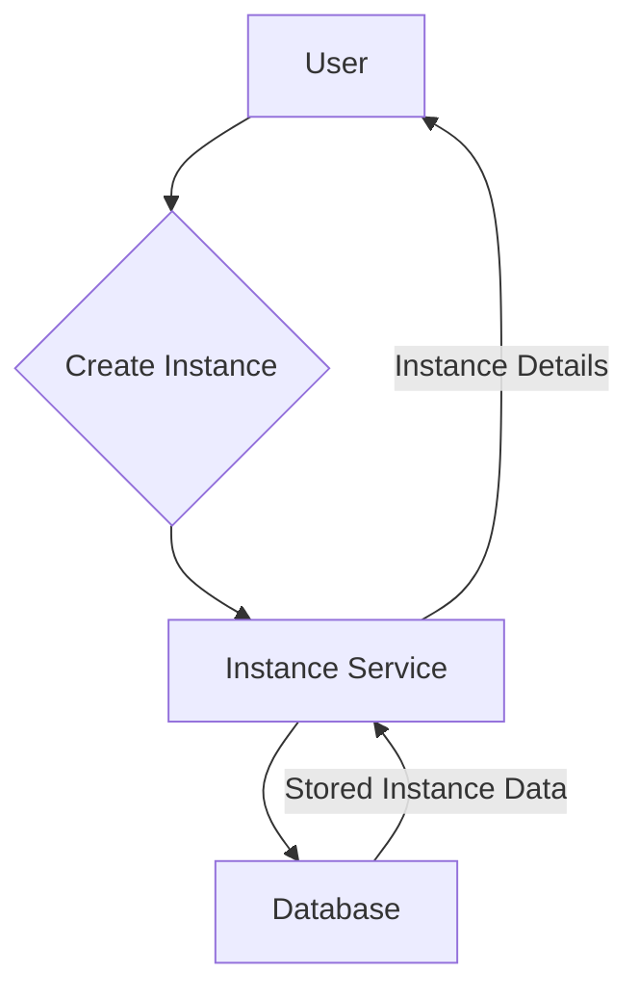
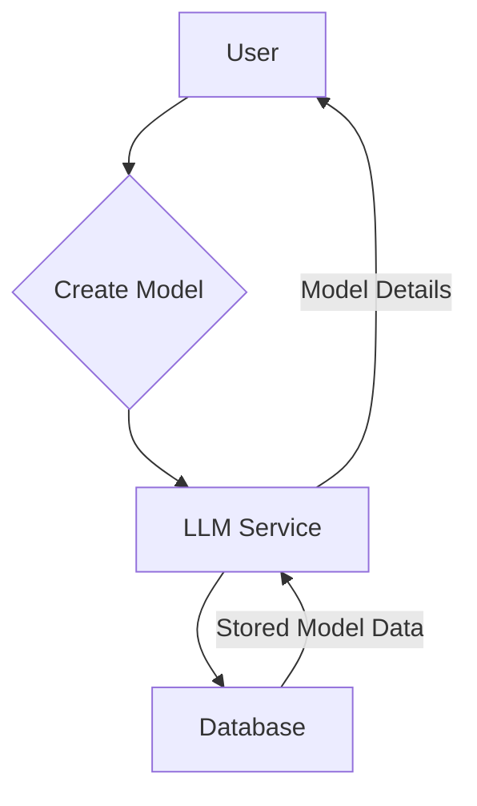
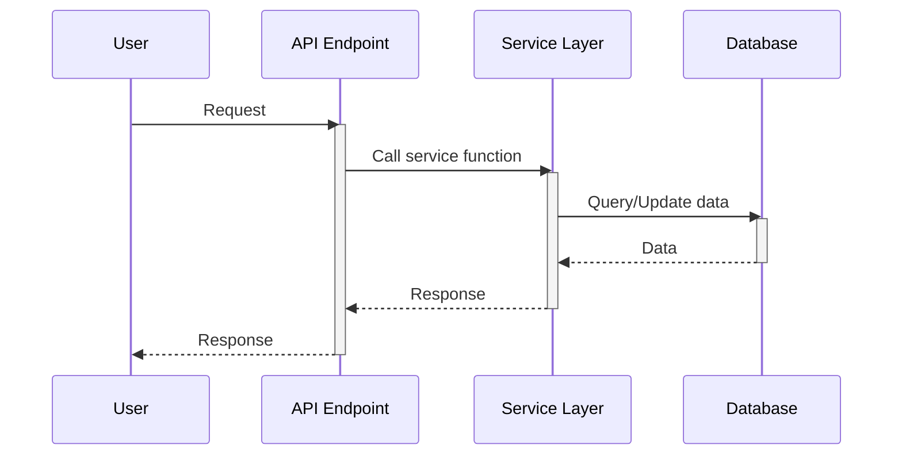
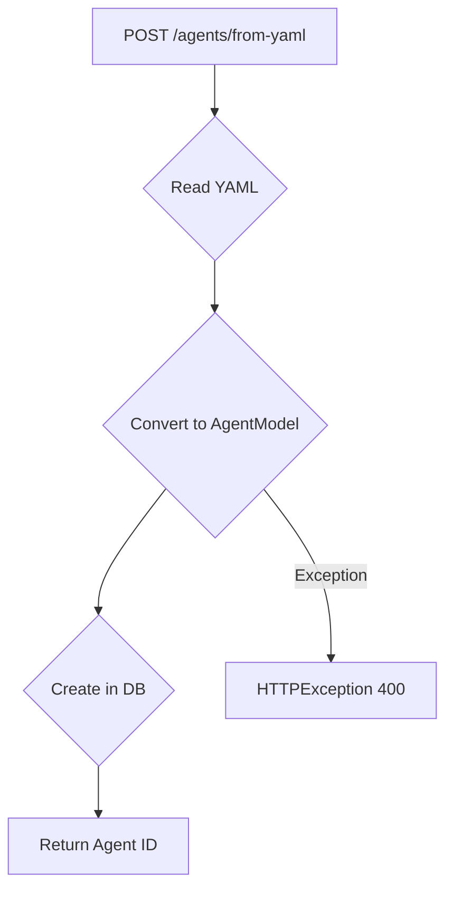
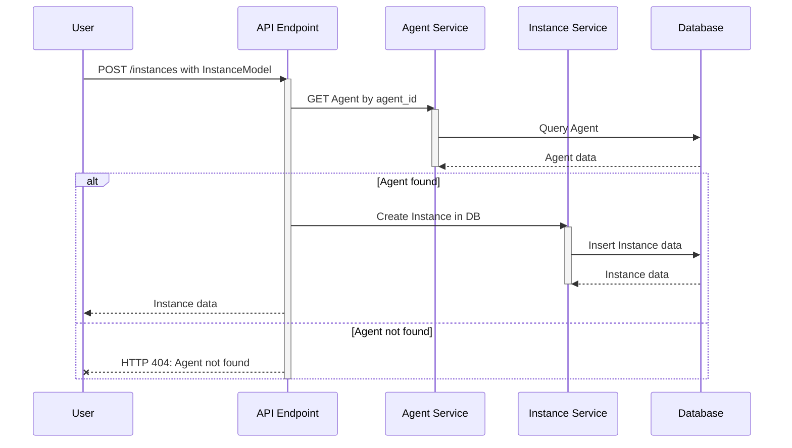
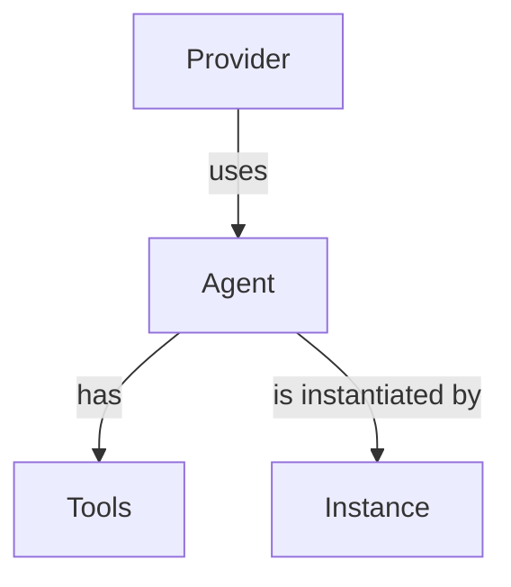
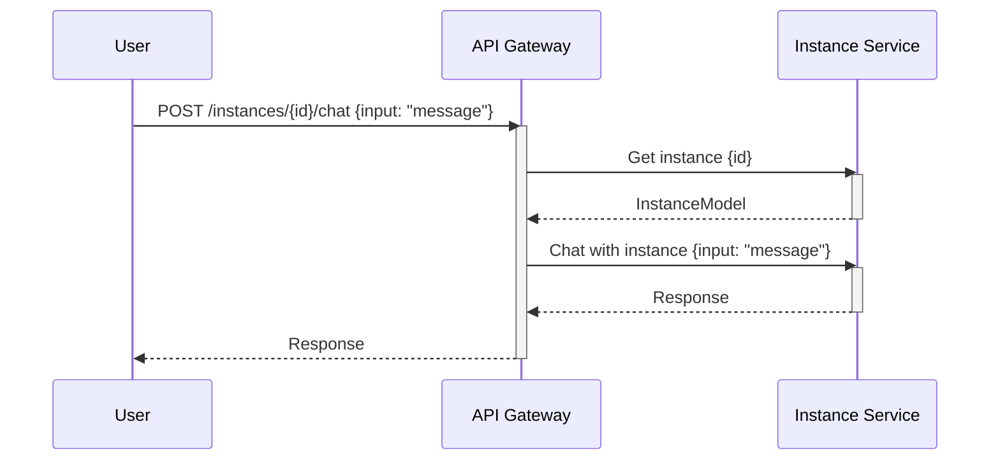

# Wiki Documentation for https://github.com/FyodorovAI/Gagarin

Generated on: 2025-05-20 13:15:03

## Table of Contents

- [Introduction](#overview-introduction)
- [Getting Started](#overview-getting-started)
- [Architecture Overview](#architecture-overview)
- [Component Details](#architecture-components)
- [Agent Management](#features-agent-management)
- [LLM Provider Integration](#features-provider-integration)
- [Instance Management](#features-instance-management)
- [Data Models](#data-models)
- [API Endpoints](#backend-api)
- [Authentication](#backend-authentication)
- [Docker Deployment](#deployment-docker)
- [SDKs](#extensibility-sdks)
- [Contributions](#extensibility-contributions)

<a id='overview-introduction'></a>

## Introduction

<details>
<summary>Relevant source files</summary>

The following files were used as context for generating this wiki page:

- [README.md](README.md)
- [src/main.py](src/main.py)
- [src/fyodorov_utils/auth/auth.py](src/fyodorov_utils/auth/auth.py)
- [src/fyodorov_utils/decorators/logging.py](src/fyodorov_utils/decorators/logging.py)
- [src/fyodorov_utils/services/yaml.py](src/fyodorov_utils/services/yaml.py)
- [src/fyodorov_llm_agents/instances/instance_service.py](src/fyodorov_llm_agents/instances/instance_service.py)
</details>

# Introduction

Gagarin is a service designed for creating and managing chatbots and agents. It allows users to integrate different LLM providers, create agents with specific prompts, grant them access to tools and information, and interact with them through various interfaces. Gagarin aims to provide a uniform way to manage LLMs, promoting flexibility and preventing vendor lock-in.  Sources: [README.md]()

The service offers features such as adding LLM providers, creating agents with prompts, granting access to tools and information, and enabling programmatic interaction through a simple API or SDK. Gagarin uses retrieval augmented generation (RAG) to allow agents to learn about various topics, including privately hosted data. Sources: [README.md]()

## Core Features

Gagarin provides a set of features to facilitate the creation and management of chatbots and agents.

*   **LLM Provider Management**: Add and manage different LLM providers in a uniform way. Sources: [README.md]()
*   **Agent Creation**: Create agents with specific prompts and configurations. Sources: [README.md]()
*   **Tool Access Control**: Grant agents access to specific tools. Sources: [README.md]()
*   **Information Access Control**: Grant agents access to specific information. Sources: [README.md]()
*   **Scalability**: Create multiple agents or instances of agents. Sources: [README.md]()
*   **API and SDK Access**: Interact with agents programmatically through a simple API or SDK. Sources: [README.md]()

## API Endpoints

The Gagarin API exposes several endpoints for managing providers, models, agents, and instances. These endpoints are implemented using FastAPI. Sources: [src/main.py]()

### Providers

*   `/providers`: Create a new provider. Sources: [src/main.py:46-63]()
*   `/providers`: Get a list of providers. Sources: [src/main.py:66-70]()
*   `/providers/{id}`: Get a specific provider by ID. Sources: [src/main.py:73-76]()
*   `/providers/{id}`: Update a provider. Sources: [src/main.py:79-82]()
*   `/providers/{id}`: Delete a provider. Sources: [src/main.py:85-88]()

### Models

*   `/models`: Create a new model. Sources: [src/main.py:91-97]()
*   `/models`: Get a list of models. Sources: [src/main.py:100-104]()
*   `/models/{id}`: Get a specific model by ID. Sources: [src/main.py:107-110]()
*   `/models/`: Get a model by name. Sources: [src/main.py:113-116]()
*   `/models/{id}`: Update a model. Sources: [src/main.py:119-122]()
*   `/models/{id}`: Delete a model. Sources: [src/main.py:125-128]()

### Agents

*   `/agents`: Create a new agent. Sources: [src/main.py:131-134]()
*   `/agents/from-yaml`: Create a new agent from a YAML configuration. Sources: [src/main.py:137-145]()
*   `/agents`: Get a list of agents. Sources: [src/main.py:148-153]()
*   `/agents/{id}`: Get a specific agent by ID. Sources: [src/main.py:156-159]()
*   `/agents/{id}`: Update an agent. Sources: [src/main.py:162-165]()
*   `/agents/{id}`: Delete an agent. Sources: [src/main.py:168-171]()
*   `/agents/{id}/tools`: Get the tools associated with an agent. Sources: [src/main.py:174-177]()
*   `/agents/{id}/tools`: Assign tools to an agent. Sources: [src/main.py:180-184]()
*   `/agents/{id}/tools/{tool_id}`: Remove a tool from an agent. Sources: [src/main.py:187-190]()

### Instances

*   `/instances`: Create a new instance. Sources: [src/main.py:193-199]()
*   `/instances`: Get a list of instances. Sources: [src/main.py:202-207]()
*   `/instances/{id}`: Get a specific instance by ID. Sources: [src/main.py:210-213]()
*   `/instances/{id}`: Update an instance. Sources: [src/main.py:216-219]()
*   `/instances/{id}`: Delete an instance. Sources: [src/main.py:222-225]()

### Chat

*   `/instances/{id}/ws`: WebSocket endpoint for real-time chat with an instance. Sources: [src/main.py:228-243]()
*   `/instances/{id}/chat`: Send a message to an instance and receive a response. Sources: [src/main.py:246-252]()
*   `/instances/{id}/stream`: Stream responses from an instance. Sources: [src/main.py:255-261]()

## Authentication

The Gagarin API uses JWT (JSON Web Tokens) for authentication. The `authenticate` function in `fyodorov_utils.auth.auth` is used as a dependency for API endpoints that require authentication.  Sources: [src/main.py:14](), [src/fyodorov_utils/auth/auth.py]()

```python
from fastapi import Depends

# Example of using the authenticate dependency
@app.get("/agents")
async def get_agents(user=Depends(authenticate)):
    return await Agent.get_all_in_db(limit=limit, created_at_lt=created_at_lt)
```
Sources: [src/main.py:148-153]()

## Request Logging

The application uses middleware to log incoming requests. This middleware logs the request method, URL, headers, and body. Sources: [src/main.py:33-41]()

```python
from fastapi import Request

@app.middleware("http")
async def log_requests(request: Request, call_next):
    # Log the request here
    print(f"Request: {request.method} {request.url}")
    print(f"Headers: {request.headers}")
    print(f"Body: {await request.body()}")

    response = await call_next(request)

    return response
```
Sources: [src/main.py:33-41]()

## Error Handling

The application uses the `error_handler` decorator from `fyodorov_utils.decorators.logging` to handle errors in API endpoints.  Sources: [src/main.py:15](), [src/fyodorov_utils/decorators/logging.py]()

```python
from fyodorov_utils.decorators.logging import error_handler

@app.get("/")
@error_handler
def root():
    return "Gagarin API v1"
```
Sources: [src/main.py:43-45]()

## YAML Support

The application supports creating agents from YAML configurations using the `/agents/from-yaml` endpoint. This functionality leverages `fyodorov_utils.services.yaml` for YAML parsing. Sources: [src/main.py:137-145](), [src/fyodorov_utils/services/yaml.py]()

## Architecture Overview

The following diagram provides a high-level overview of the Gagarin architecture:

```mermaid
graph TD
    API[FastAPI Application] --> Auth[Authentication Middleware];
    API --> Logging[Request Logging Middleware];
    API --> ErrorHandling[Error Handler Decorator];
    API --> Providers[Provider Endpoints];
    API --> Models[Model Endpoints];
    API --> Agents[Agent Endpoints];
    API --> Instances[Instance Endpoints];
    API --> Chat[Chat Endpoints];
    Auth --> JWT[JWT Authentication];
    Providers
Error: 503 The model is overloaded. Please try again later.

---

<a id='overview-getting-started'></a>

## Getting Started

<details>
<summary>Relevant source files</summary>

The following files were used as context for generating this wiki page:

- [README.md](README.md)
- [src/main.py](src/main.py)
- [src/requirements.txt](src/requirements.txt)
- [src/tests/test_agent_model.py](src/tests/test_agent_model.py)
- [src/tests/test_provider_model.py](src/tests/test_provider_model.py)
- [src/tests/test_agent_integration.py](src/tests/test_agent_integration.py)
</details>

# Getting Started

Gagarin is a service designed for creating and managing chatbots and agents. It allows users to integrate different LLM providers, define agent prompts, grant access to tools and information, and interact with these agents through various interfaces. This guide provides an overview of how to get started with Gagarin, covering the essential features and setup. Sources: [README.md]()

## Installation and Setup

To begin using Gagarin, you need to set up the environment and install the necessary dependencies.

### Prerequisites

Before installing Gagarin, ensure you have the following prerequisites:

-   Python 3.6 or higher
-   `pip` package installer

### Installing Dependencies

Gagarin relies on several Python packages, which are listed in the `requirements.txt` file. To install these dependencies, navigate to the project directory and run the following command:

```bash
pip install -r src/requirements.txt
```

This command installs all the required packages, including `fastapi`, `uvicorn`, `pydantic`, and others necessary for running the Gagarin service. Sources: [src/requirements.txt]()

### Running the Application

Once the dependencies are installed, you can run the Gagarin application using Uvicorn, an ASGI server. Execute the following command from the project directory:

```bash
uvicorn src.main:app --host 0.0.0.0 --port 3000
```

This command starts the Gagarin API server on host `0.0.0.0` and port `3000`. You can then access the API endpoints through your web browser or using tools like `curl` or Postman. Sources: [src/main.py:437]()

## Core Features

Gagarin offers several key features that facilitate the creation and management of chatbots and agents.

### LLM Provider Integration

Gagarin allows you to add and manage different LLM providers in a uniform way. This abstraction enables you to use the most suitable model for your specific use case without being locked into a single provider. Sources: [README.md]()

#### Adding a Provider

To add an LLM provider, you can use the `/providers` endpoint. This endpoint accepts a JSON payload that conforms to the `ProviderModel`.

```python
from pydantic import HttpUrl
from fyodorov_llm_agents.providers.provider_model import ProviderModel

provider_data = {
    "provider_name": "openai",
    "api_url": "https://api.openai.com",
    "api_key": "your_api_key",
    "models": ["gpt-3.5-turbo"]
}

provider = ProviderModel(**provider_data)
```

The `ProviderModel` includes fields such as `provider_name`, `api_url`, `api_key`, and `models`. The `api_url` field must be a valid HTTP URL. Sources: [src/main.py:76-83](), [src/tests/test_provider_model.py:4-7]()

### Agent Creation

Agents are the core entities in Gagarin, representing individual chatbots or automated assistants. You can create agents with specific prompts, tools, and access to information.

#### Defining an Agent

To create an agent, you need to define its properties using the `AgentModel`.

```python
from fyodorov_llm_agents.agents.agent_model import Agent as AgentModel

agent_data = {
    "provider": "openai",
    "model": "gpt-3.5-turbo",
    "name_for_human": "My Agent",
    "description_for_human": "A helpful assistant",
    "prompt": "You are a helpful assistant.",
    "prompt_size": 1000
}

agent = AgentModel(**agent_data)
```

The `AgentModel` includes fields such as `provider`, `model`, `name_for_human`, `description_for_human`, `prompt`, and `prompt_size`. The `name_for_human` and `description_for_human` fields have validation constraints on their length and content. Sources: [src/main.py:289-295](), [src/tests/test_agent_model.py:15-23]()

#### Creating an Agent via API

You can create an agent by sending a POST request to the `/agents` endpoint with the agent data in JSON format. The API handles the creation and storage of the agent in the database. Sources: [src/main.py:289-295]()

### Instance Management

Instances represent specific deployments or configurations of an agent. You can create multiple instances of the same agent with different settings or access permissions.

#### Creating an Instance

To create an instance, you need to define its properties using the `InstanceModel`. The most important property is `agent_id`, which links the instance to a specific agent. Sources: [src/main.py:349-353]()

```python
from fyodorov_llm_agents.instances.instance_model import InstanceModel

instance_data = {
    "agent_id": "your_agent_id"
}

instance = InstanceModel(**instance_data)
```

#### Creating an Instance via API

You can create an instance by sending a POST request to the `/instances` endpoint with the instance data in JSON format. The API validates the `agent_id` and creates the instance in the database. Sources: [src/main.py:349-353]()

### Interacting with Agents

Gagarin provides several ways to interact with agents, including chat endpoints and WebSocket connections.

#### Chat Endpoint

The `/instances/{id}/chat` endpoint allows you to send messages to an agent instance and receive responses. This endpoint accepts a JSON payload with the input message and returns the agent's response. Sources: [src/main.py:377-383]()

#### WebSocket Connection

Gagarin also supports real-time communication with agents via WebSockets. The `/instances/{id}/ws` endpoint allows you to establish a WebSocket connection with an agent instance and send messages back and forth. This is useful for building interactive chat applications. Sources: [src/main.py:361-374]()

## Testing

Gagarin includes a suite of tests to ensure the reliability and correctness of its components. These tests cover various aspects of the system, including model validation, API endpoint functionality, and integration with external services.

### Running Tests

To run the tests, you can use the `pytest` framework. First, install the test dependencies:

```bash
pip install -r src/requirements-test.txt
```

Then, navigate to the project directory and run the tests:

```bash
pytest src/tests
```

This command executes all the tests in the `src/tests` directory and reports the results. Sources: [src/requirements-test.txt]()

### Example Tests

The test suite includes tests for validating the `AgentModel` and `ProviderModel`, as well as integration tests for the agent and provider services. For example, the `test_agent_model.py` file contains tests for validating the properties of the `AgentModel`, such as the `name_for_human` and `description_for_human` fields. Sources: [src/tests/test_agent_model.py](), [src/tests/test_provider_model.py](), [src/tests/test_agent_integration.py]()

## Conclusion

This guide provides a basic overview of how to get started with Gagarin. By following these steps, you can set up the environment, install the dependencies, and start exploring the core features of Gagarin.


---

<a id='architecture-overview'></a>

## Architecture Overview

<details>
<summary>Relevant source files</summary>

The following files were used as context for generating this wiki page:

- [src/main.py](src/main.py)
- [fyodorov_utils/auth/auth.py](fyodorov_utils/auth/auth.py)
- [fyodorov_llm_agents/instances/instance_service.py](fyodorov_llm_agents/instances/instance_service.py)
- [fyodorov_llm_agents/agents/agent_service.py](fyodorov_llm_agents/agents/agent_service.py)
- [fyodorov_llm_agents/providers/provider_service.py](fyodorov_llm_agents/providers/provider_service.py)
- [fyodorov_llm_agents/models/llm_service.py](fyodorov_llm_agents/models/llm_service.py)
</details>

# Architecture Overview

Gagarin is a service designed for creating and managing chatbots and agents. It provides a flexible architecture that allows users to integrate different LLM providers, create agents with specific prompts, grant access to tools and information, and interact with these agents through various interfaces. The service uses a FastAPI backend to expose API endpoints for managing providers, agents, instances, and models. [src/main.py:21-24]()

The architecture supports programmatic interaction with agents through a well-defined API, as well as SDKs. Gagarin's architecture focuses on modularity and ease of integration, allowing developers to use the most suitable models for their specific use cases without being locked into a single provider. [README.md]()

## Core Components

The Gagarin architecture consists of several core components, each responsible for a specific aspect of agent management and interaction. These components include providers, agents, instances, and models, all managed through a FastAPI application. [src/main.py:26-30]()

### Providers

Providers represent the LLM services that Gagarin integrates with. The `Provider` service handles the management of these providers, allowing users to add, retrieve, update, and delete provider configurations. [src/main.py:53-78](), [fyodorov_llm_agents/providers/provider_service.py]()



This diagram illustrates the flow of creating a provider, where a user initiates the process, the `Provider` service handles the request, and the provider data is stored in a database. Sources: [src/main.py:53-78](), [fyodorov_llm_agents/providers/provider_service.py]()

### Agents

Agents are the core entities that interact with the world through tools and information. The `Agent` service is responsible for creating, managing, and configuring agents, including assigning tools and defining prompts. [src/main.py:105-158](), [fyodorov_llm_agents/agents/agent_service.py]()



This diagram illustrates the flow of creating an agent, where a user initiates the process, the `Agent` service handles the request, and the agent data is stored in a database. Sources: [src/main.py:105-158](), [fyodorov_llm_agents/agents/agent_service.py]()

### Instances

Instances represent specific running versions of an agent. The `Instance` service manages the creation, retrieval, updating, and deletion of agent instances. These instances are used to interact with the agents and execute their defined behaviors. [src/main.py:168-213](), [fyodorov_llm_agents/instances/instance_service.py]()



This diagram illustrates the flow of creating an instance, where a user initiates the process, the `Instance` service handles the request, and the instance data is stored in a database. Sources: [src/main.py:168-213](), [fyodorov_llm_agents/instances/instance_service.py]()

### Models

Models represent the specific LLMs used by the agents. The `LLM` service manages the available models, allowing users to add, retrieve, update, and delete model configurations. [src/main.py:78-104](), [fyodorov_llm_agents/models/llm_service.py]()



This diagram illustrates the flow of creating a model, where a user initiates the process, the `LLM` service handles the request, and the model data is stored in a database. Sources: [src/main.py:78-104](), [fyodorov_llm_agents/models/llm_service.py]()

## API Endpoints

The Gagarin API provides endpoints for managing providers, agents, instances, and models. These endpoints are secured using JWT authentication. [src/main.py:40]()

### Providers API

| Endpoint        | Method | Description                               |
| --------------- | ------ | ----------------------------------------- |
| `/providers`    | POST   | Create a new provider                     |
| `/providers`    | GET    | Get a list of providers                   |
| `/providers/{id}` | GET    | Get a specific provider by ID             |
| `/providers/{id}` | PUT    | Update a provider                         |
| `/providers/{id}` | DELETE | Delete a provider                         |

Sources: [src/main.py:53-78](), [fyodorov_llm_agents/providers/provider_service.py]()

### Agents API

| Endpoint        | Method | Description                             |
| --------------- | ------ | --------------------------------------- |
| `/agents`       | POST   | Create a new agent                      |
| `/agents`       | GET    | Get a list of agents                    |
| `/agents/{id}`  | GET    | Get a specific agent by ID              |
| `/agents/{id}`  | PUT    | Update an agent                          |
| `/agents/{id}`  | DELETE | Delete an agent                          |
|`/agents/{id}/tools`| GET | Get agent tools |
|`/agents/{id}/tools`| POST | Assign agent tools |
|`/agents/{id}/tools/{tool_id}`| DELETE | Remove agent tool |

Sources: [src/main.py:105-158](), [fyodorov_llm_agents/agents/agent_service.py]()

### Instances API

| Endpoint          | Method | Description                               |
| ----------------- | ------ | ----------------------------------------- |
| `/instances`       | POST   | Create a new instance                     |
| `/instances`       | GET    | Get a list of instances                   |
| `/instances/{id}`  | GET    | Get a specific instance by ID             |
| `/instances/{id}`  | PUT    | Update an instance                         |
| `/instances/{id}`  | DELETE | Delete an instance                         |
| `/instances/{id}/ws`| WEBSOCKET | Chat via websocket |
| `/instances/{id}/chat`| GET | Chat with an instance |
| `/instances/{id}/stream`| GET | Stream responses from an instance |

Sources: [src/main.py:168-213](), [fyodorov_llm_agents/instances/instance_service.py]()

### Models API

| Endpoint      | Method | Description                           |
| ------------- | ------ | ------------------------------------- |
| `/models`     | POST   | Create a new model                    |
| `/models`     | GET    | Get a list of models                  |
| `/models/{id}`| GET    | Get a specific model by ID            |
| `/models/`| GET | Get a model by name |
| `/models/{id}`| PUT    | Update a model                       |
| `/models/{id}`| DELETE | Delete a model                       |

Sources: [src/main.py:78-104](), [fyodorov_llm_agents/models/llm_service.py]()

## Authentication

The Gagarin API uses JWT (JSON Web Token) authentication to secure its endpoints. The `authenticate` function from `fyodorov_utils.auth.auth` is used as a dependency in the API endpoints to verify the user's identity. [src/main.py:40](), [fyodorov_utils/auth/auth.py]()

```python
from fastapi import Depends

@app.get("/providers")
async def get_providers(user=Depends(authenticate)):
    return await Provider.get_providers()
```

This code snippet shows how the `authenticate` function is used as a dependency to protect the `/providers` endpoint.  Only authenticated users can access this endpoint. Sources: [src/main.py:61-65](), [fyodorov_utils/auth/auth.py]()

## Data Flow

The data flow within Gagarin involves the interaction between the user, the API endpoints, the service layers (Provider, Agent, Instance, LLM), and the database. The user sends requests to the API endpoints, which then call the appropriate service layer functions. The service layer functions interact with the database to retrieve or store data.



This sequence diagram illustrates the general data flow within Gagarin, showing how user requests are processed through the API endpoints, service layers, and database. Sources: [src/main.py](), [fyodorov_llm_agents/providers/provider_service.py](), [fyodorov_llm_agents/agents/agent_service.py](), [fyodorov_llm_agents/instances/instance_service.py](), [fyodorov_llm_agents/models/llm_service.py]()

## Conclusion

The Gagarin architecture provides a flexible and modular platform for managing chatbots and agents. By integrating different LLM providers, creating agents with specific prompts, and providing access to tools and information, Gagarin enables developers to build powerful and customizable conversational AI applications. The API-driven architecture and the use of JWT authentication ensure security and ease of integration.


---

<a id='architecture-components'></a>

## Component Details

<details>
<summary>Relevant source files</summary>

The following files were used as context for generating this wiki page:

- [src/main.py](src/main.py)
- [fyodorov_utils/auth/auth.py](fyodorov_utils/auth/auth.py)
- [fyodorov_llm_agents/instances/instance_service.py](fyodorov_llm_agents/instances/instance_service.py)
- [fyodorov_llm_agents/agents/agent_service.py](fyodorov_llm_agents/agents/agent_service.py)
- [fyodorov_llm_agents/models/llm_service.py](fyodorov_llm_agents/models/llm_service.py)
- [fyodorov_llm_agents/providers/provider_service.py](fyodorov_llm_agents/providers/provider_service.py)
</details>

# Component Details

Gagarin is a service designed for creating and managing chatbots and agents. It provides a structured way to integrate different LLM providers, define agents with specific prompts and tools, and manage interactions with these agents through various interfaces. The system uses retrieval augmented generation (RAG) to enhance agent knowledge with specific data.  This document details the core components of the Gagarin service, focusing on the API endpoints and their functionalities.

## API Endpoints

The Gagarin service exposes a comprehensive set of API endpoints for managing providers, models, agents, and instances. These endpoints are built using FastAPI and provide functionalities for creating, retrieving, updating, and deleting resources. The API uses authentication via JWT tokens for securing access to the endpoints. `Sources: [src/main.py:15-17]()`

### Providers

The provider endpoints manage different LLM providers that Gagarin integrates with. These endpoints allow you to add, retrieve, update, and delete provider configurations. `Sources: [src/main.py:48-87]()`

#### Create Provider

This endpoint allows you to add a new LLM provider to the system. It takes a `ProviderModel` as input, which includes the provider's name, API URL, and API key. The endpoint also handles replacing "localhost" in the API URL with the actual IP address if the provider is running locally.

```python
@app.post("/providers")
@error_handler
async def create_provider(
    provider: ProviderModel, request: Request, user=Depends(authenticate)
):
    print(f"User: {user}")
    if "localhost" in str(provider.api_url):
        print("Replacing IP in API URL")
        # Get the IP address of the user
        print(f"Request: {request.headers}")
        if "X-Forwarded-For" in request.headers:
            ip = request.headers.get("X-Forwarded-For", "localhost")
            if ip == "localhost" and hasattr(request, "remote_addr"):
                ip = request.remote_addr
            print(f"IP: {ip}")
            # Replace the API URL with the new IP
            provider.api_url = HttpUrl(str(provider.api_url).replace("localhost", ip))
            print(f"New API URL: {provider.api_url}")
    print(f"ProviderModel: {provider}")
    return await Provider.save_provider_in_db(
        access_token=user["session_id"], provider=provider, user_id=user["sub"]
    )
```
Sources: [src/main.py:48-71]()

#### Get Providers

This endpoint retrieves a list of providers, with optional pagination using `limit` and `created_at_lt` parameters.

```python
@app.get("/providers")
@error_handler
async def get_providers(
    limit: int = 10,
    created_at_lt: datetime = datetime.now(),
    user=Depends(authenticate),
):
    return await Provider.get_providers(limit=limit, created_at_lt=created_at_lt)
```
Sources: [src/main.py:73-79]()

#### Get Provider by ID

This endpoint retrieves a specific provider by its ID.

```python
@app.get("/providers/{id}")
@error_handler
async def get_provider(id: str, user=Depends(authenticate)):
    return await Provider.get_provider_by_id(id)
```
Sources: [src/main.py:81-84]()

#### Update Provider

This endpoint updates an existing provider with the provided data.

```python
@app.put("/providers/{id}")
@error_handler
async def update_provider(id: str, provider: dict, user=Depends(authenticate)):
    return await Provider.update_provider_in_db(id, update=provider)
```
Sources: [src/main.py:86-89]()

#### Delete Provider

This endpoint deletes a provider by its ID.

```python
@app.delete("/providers/{id}")
@error_handler
async def delete_provider(id: str, user=Depends(authenticate)):
    return await Provider.delete_provider_in_db(id)
```
Sources: [src/main.py:91-94]()

### Models

The model endpoints manage the LLMs that are used by the agents. These endpoints allow you to add, retrieve, update, and delete LLM configurations. `Sources: [src/main.py:96-137]()`

#### Create Model

This endpoint creates a new LLM model.

```python
@app.post("/models")
@error_handler
async def create_model(model: dict, user=Depends(authenticate)):
    print(f"Model: {model}")
    print(f"User: {user}")
    model_obj = LLM.from_dict(model)
    return await LLM.save_model_in_db(
        access_token=user["session_id"], user_id=user["sub"], model=model_obj
    )
```
Sources: [src/main.py:96-105]()

#### Get Models

This endpoint retrieves a list of LLM models, with optional pagination.

```python
@app.get("/models")
@error_handler
async def get_models(
    limit: int = 10,
    created_at_lt: datetime = datetime.now(),
    user=Depends(authenticate),
):
    return await LLM.get_models(limit=limit, created_at_lt=created_at_lt)
```
Sources: [src/main.py:107-113]()

#### Get Model by ID

This endpoint retrieves a specific LLM model by its ID.

```python
@app.get("/models/{id}")
@error_handler
async def get_model(id: str, user=Depends(authenticate)):
    return await LLM.get_model(id=id)
```
Sources: [src/main.py:115-118]()

#### Get Model by Name

This endpoint retrieves a specific LLM model by its name.

```python
@app.get("/models/")
@error_handler
async def get_model_by_name(name: str, user=Depends(authenticate)):
    return await LLM.get_model(
        user_id=user["sub"], name=name
    )
```
Sources: [src/main.py:120-126]()

#### Update Model

This endpoint updates an existing LLM model.

```python
@app.put("/models/{id}")
@error_handler
async def update_model(id: str, model: dict, user=Depends(authenticate)):
    return await LLM.update_model(id, model)
```
Sources: [src/main.py:128-131]()

#### Delete Model

This endpoint deletes an LLM model.

```python
@app.delete("/models/{id}")
@error_handler
async def delete_model(id: str, user=Depends(authenticate)):
    return await LLM.delete_model_in_db(access_token=user["session_id"], user_id=user["sub"], name=None, id=id)
```
Sources: [src/main.py:133-137]()

### Agents

The agent endpoints manage the agents that are used to interact with the LLMs. These endpoints allow you to create, retrieve, update, and delete agents. `Sources: [src/main.py:139-199]()`

#### Create Agent

This endpoint creates a new agent.

```python
@app.post("/agents")
@error_handler
async def create_agent(agent: AgentModel, user=Depends(authenticate)):
    agent_id = await Agent.create_in_db(user["session_id"], agent)
    return agent_id
```
Sources: [src/main.py:139-143]()

#### Create Agent from YAML

This endpoint creates a new agent from a YAML file.

```python
@app.post("/agents/from-yaml")
@error_handler
async def create_agent_from_yaml(request: Request, user=Depends(authenticate)):
    try:
        agent_yaml = await request.body()
        agent = AgentModel.from_yaml(agent_yaml)
        return await Agent.create_in_db(user["session_id"], agent)
    except Exception as e:
        print("Error creating agent from yaml", str(e))
        raise HTTPException(status_code=400, detail="Invalid YAML format")
```
Sources: [src/main.py:145-154]()

#### Get Agents

This endpoint retrieves a list of agents, with optional pagination.

```python
@app.get("/agents")
@error_handler
async def get_agents(
    user=Depends(authenticate),
    limit: int = 10,
    created_at_lt: datetime = datetime.now(),
):
    return await Agent.get_all_in_db(limit=limit, created_at_lt=created_at_lt)
```
Sources: [src/main.py:156-162]()

#### Get Agent by ID

This endpoint retrieves a specific agent by its ID.

```python
@app.get("/agents/{id}")
@error_handler
async def get_agent(id: str, user=Depends(authenticate)):
    return await Agent.get_in_db(id)
```
Sources: [src/main.py:164-167]()

#### Update Agent

This endpoint updates an existing agent.

```python
@app.put("/agents/{id}")
@error_handler
async def update_agent(id: str, agent: dict, user=Depends(authenticate)):
    return await Agent.update_in_db(id, agent)
```
Sources: [src/main.py:169-172]()

#### Delete Agent

This endpoint deletes an agent.

```python
@app.delete("/agents/{id}")
@error_handler
async def delete_agent(id: str, user=Depends(authenticate)):
    return await Agent.delete_in_db(id)
```
Sources: [src/main.py:174-177]()

#### Get Agent Tools

This endpoint retrieves the tools associated with a specific agent.

```python
@app.get("/agents/{id}/tools")
@error_handler
async def get_agent_tools(id: str, user=Depends(authenticate)):
    return await Agent.get_agent_tools(user["session_id"], id)
```
Sources: [src/main.py:179-182]()

#### Assign Agent Tools

This endpoint assigns tools to a specific agent.

```python
@app.post("/agents/{id}/tools")
@error_handler
async def assign_agent_tools(
    id: str, tools: list[ToolModel], user=Depends(authenticate)
):
    return await Agent.assign_agent_tools(user["session_id"], id
Error: 503 The model is overloaded. Please try again later.

---

<a id='features-agent-management'></a>

## Agent Management

<details>
<summary>Relevant source files</summary>

The following files were used as context for generating this wiki page:

- [src/main.py](src/main.py)
- [src/tests/test_agent_model.py](src/tests/test_agent_model.py)
- [src/fyodorov_utils/auth/auth.py](src/fyodorov_utils/auth/auth.py)
- [src/fyodorov_llm_agents/agents/agent_service.py](src/fyodorov_llm_agents/agents/agent_service.py)
- [src/fyodorov_llm_agents/agents/agent_model.py](src/fyodorov_llm_agents/agents/agent_model.py)
- [src/tests/test_agent_integration.py](src/tests/test_agent_integration.py)
</details>

# Agent Management

Agent Management in Gagarin involves creating, retrieving, updating, and deleting agents. Agents are managed via API endpoints defined in `src/main.py` and interact with various services. The system provides functionalities for defining agent characteristics, assigning tools, and managing their lifecycle. Agents can be created from YAML configurations or defined using a specific data model. [Link to Instances Management](#instances-management) if applicable.

## Agent Creation

Agents can be created through the `/agents` endpoint using a POST request with an `AgentModel` or from a YAML configuration using the `/agents/from-yaml` endpoint.

### Creating Agents from AgentModel

The `/agents` endpoint expects an `AgentModel` in the request body. The `AgentModel` includes fields such as `provider`, `model`, `name_for_human`, `description_for_human`, `prompt`, `prompt_size`, `rag`, and `tools`. The `Agent.create_in_db` function handles the creation of the agent in the database, using the session ID of the user. Sources: [src/main.py:44-47](), [src/fyodorov_llm_agents/agents/agent_model.py](), [src/fyodorov_llm_agents/agents/agent_service.py]()

```python
@app.post("/agents")
@error_handler
async def create_agent(agent: AgentModel, user=Depends(authenticate)):
    agent_id = await Agent.create_in_db(user["session_id"], agent)
    return agent_id
```
Sources: [src/main.py:44-47]()

### Creating Agents from YAML

The `/agents/from-yaml` endpoint allows creating agents from a YAML configuration file. The endpoint receives the YAML content, converts it into an `AgentModel`, and then saves it to the database. If the YAML format is invalid, an HTTP exception with a 400 status code is raised.

```python
@app.post("/agents/from-yaml")
@error_handler
async def create_agent_from_yaml(request: Request, user=Depends(authenticate)):
    try:
        agent_yaml = await request.body()
        agent = AgentModel.from_yaml(agent_yaml)
        return await Agent.create_in_db(user["session_id"], agent)
    except Exception as e:
        print("Error creating agent from yaml", str(e))
        raise HTTPException(status_code=400, detail="Invalid YAML format")
```
Sources: [src/main.py:49-57]()



This diagram illustrates the flow of creating an agent from a YAML configuration. Sources: [src/main.py:49-57]()

## Agent Retrieval

Agents can be retrieved individually by their ID or as a list with optional pagination.

### Retrieving a List of Agents

The `/agents` endpoint supports retrieving a list of agents with pagination. The `limit` parameter specifies the maximum number of agents to return, and `created_at_lt` filters agents created before a certain timestamp.

```python
@app.get("/agents")
@error_handler
async def get_agents(
    user=Depends(authenticate),
    limit: int = 10,
    created_at_lt: datetime = datetime.now(),
):
    return await Agent.get_all_in_db(limit=limit, created_at_lt=created_at_lt)
```
Sources: [src/main.py:59-66]()

### Retrieving an Agent by ID

The `/agents/{id}` endpoint retrieves a specific agent by its ID. The `Agent.get_in_db` function fetches the agent from the database.

```python
@app.get("/agents/{id}")
@error_handler
async def get_agent(id: str, user=Depends(authenticate)):
    return await Agent.get_in_db(id)
```
Sources: [src/main.py:68-71]()

## Agent Update

Agents can be updated via the `/agents/{id}` endpoint using a PUT request. The request body should contain the fields to be updated. The `Agent.update_in_db` function handles the update in the database.

```python
@app.put("/agents/{id}")
@error_handler
async def update_agent(id: str, agent: dict, user=Depends(authenticate)):
    return await Agent.update_in_db(id, agent)
```
Sources: [src/main.py:73-76]()

## Agent Deletion

Agents can be deleted via the `/agents/{id}` endpoint using a DELETE request. The `Agent.delete_in_db` function handles the deletion in the database.

```python
@app.delete("/agents/{id}")
@error_handler
async def delete_agent(id: str, user=Depends(authenticate)):
    return await Agent.delete_in_db(id)
```
Sources: [src/main.py:78-81]()

## Agent Tools Management

Agents can have tools assigned to them. The `/agents/{id}/tools` endpoint is used to manage the tools associated with an agent.

### Retrieving Agent Tools

The `/agents/{id}/tools` endpoint retrieves the tools associated with a specific agent.

```python
@app.get("/agents/{id}/tools")
@error_handler
async def get_agent_tools(id: str, user=Depends(authenticate)):
    return await Agent.get_agent_tools(user["session_id"], id)
```
Sources: [src/main.py:83-86]()

### Assigning Tools to an Agent

The `/agents/{id}/tools` endpoint, when used with a POST request, assigns a list of tools to an agent. The tools are provided as a list of `ToolModel` objects in the request body.

```python
@app.post("/agents/{id}/tools")
@error_handler
async def assign_agent_tools(
    id: str, tools: list[ToolModel], user=Depends(authenticate)
):
    return await Agent.assign_agent_tools(user["session_id"], id, tools)
```
Sources: [src/main.py:88-92]()

### Removing a Tool from an Agent

The `/agents/{id}/tools/{tool_id}` endpoint removes a specific tool from an agent's tool list.

```python
@app.delete("/agents/{id}/tools/{tool_id}")
@error_handler
async def remove_agent_tool(id: str, tool_id: str, user=Depends(authenticate)):
    return await Agent.delete_agent_tool_connection(user["session_id"], id, tool_id)
```
Sources: [src/main.py:94-97]()

## Agent Model Validation

The `AgentModel` includes validation to ensure data integrity.

### Validation Rules

The following validations are performed on the `AgentModel`:

*   `name_for_human`: Must be a string with a maximum length of 100 characters and must match the regex `^[a-zA-Z0-9 _-]*$`. Sources: [src/tests/test_agent_model.py:32-35]()
*   `description_for_human`: Must be a string with a maximum length of 1000 characters and must match the regex `^[a-zA-Z0-9 _-]*$`. Sources: [src/tests/test_agent_model.py:40-43]()
*   `api_url`: Must be a valid URL. Sources: [src/tests/test_agent_model.py:46-51]()

### Validation Tests

The `test_agent_model.py` file includes tests for validating the `AgentModel`. These tests ensure that the validation rules are enforced correctly.

```python
def test_default_agent_validation():
    agent = get_default_agent()
    is_valid = agent.validate()
    assert is_valid, "Default agent should be valid"
```
Sources: [src/tests/test_agent_model.py:26-30]()

```python
def test_long_name_for_human():
    long_name_agent = get_default_agent(name_for_human="A" * 101)
    is_valid = long_name_agent.validate()
    assert not is_valid, "Long name for human should result in an invalid agent"
```
Sources: [src/tests/test_agent_model.py:32-35]()

```python
def test_invalid_name_for_human():
    invalid_name_agent = get_default_agent(name_for_human="My Agent @!")
    is_valid = invalid_name_agent.validate()
    assert not is_valid, "Invalid name for human should result in an invalid agent"
```
Sources: [src/tests/test_agent_model.py:37-40]()

## Authentication

The `authenticate` function from `fyodorov_utils.auth.auth` is used to authenticate requests to the agent management endpoints. This ensures that only authorized users can create, retrieve, update, or delete agents. Sources: [src/main.py:44](), [src/fyodorov_utils/auth/auth.py]()

## Summary

Agent Management provides a comprehensive set of API endpoints and functionalities for managing agents within the Gagarin system. It supports creating agents from YAML or `AgentModel` objects, retrieving agents by ID or as a list, updating agent properties, deleting agents, and managing the tools associated with agents. The `AgentModel` includes validation rules to ensure data integrity, and authentication is used to protect the agent management endpoints.


---

<a id='features-provider-integration'></a>

## LLM Provider Integration

<details>
<summary>Relevant source files</summary>

The following files were used as context for generating this wiki page:

- [src/main.py](src/main.py)
- [src/tests/test_provider_model.py](src/tests/test_provider_model.py)
- [fyodorov_llm_agents/providers/provider_service.py](fyodorov_llm_agents/providers/provider_service.py)
- [fyodorov_llm_agents/providers/provider_model.py](fyodorov_llm_agents/providers/provider_model.py)
- [src/tests/test_provider_integration.py](src/tests/test_provider_integration.py)
- [requirements.txt](requirements.txt)
</details>

# LLM Provider Integration

LLM Provider Integration in Gagarin allows the system to connect and manage different Language Model providers. This integration abstracts the underlying API calls to different LLMs, providing a uniform interface for agents to utilize various models. It includes functionalities for adding, retrieving, updating, and deleting provider configurations.  The integration supports authentication and ensures that only authorized users can manage providers. [src/main.py]()

The provider integration is crucial for enabling agents to access different LLMs and leverage their unique capabilities.  By managing providers centrally, the system can easily switch between models, optimize costs, and ensure that agents have access to the best possible resources. [src/main.py]()

## Provider Management

This section details how providers are managed within the Gagarin system. It covers the API endpoints, data models, and database interactions involved in creating, retrieving, updating, and deleting providers. Sources: [src/main.py](), [fyodorov_llm_agents/providers/provider_service.py](), [fyodorov_llm_agents/providers/provider_model.py]()

### API Endpoints

The Gagarin API exposes several endpoints for managing providers. These endpoints are secured using authentication and authorization mechanisms. Sources: [src/main.py]()

The following table summarizes the available API endpoints:

| Endpoint           | HTTP Method | Description                               |
| ------------------ | ----------- | ----------------------------------------- |
| `/providers`       | POST        | Creates a new provider.                   |
| `/providers`       | GET         | Retrieves a list of providers.            |
| `/providers/{id}`  | GET         | Retrieves a specific provider by ID.      |
| `/providers/{id}`  | PUT         | Updates an existing provider.             |
| `/providers/{id}`  | DELETE      | Deletes a provider.                       |

Sources: [src/main.py]()

### Provider Model

The `ProviderModel` defines the data structure for representing a provider. It includes fields such as provider name, API URL, API key, and a list of supported models. Sources: [fyodorov_llm_agents/providers/provider_model.py]()

```python
class ProviderModel(BaseModel):
    provider_name: str
    api_url: HttpUrl
    api_key: str
    models: list[str]
```
Sources: [fyodorov_llm_agents/providers/provider_model.py]()

The `ProviderModel` uses Pydantic for data validation. The `api_url` field is validated as a `HttpUrl` to ensure that it is a valid URL. Sources: [fyodorov_llm_agents/providers/provider_model.py](), [requirements.txt]()

### Database Interactions

The `Provider` class in `provider_service.py` handles the database interactions for providers. It provides methods for saving, retrieving, updating, and deleting providers in the database. Sources: [fyodorov_llm_agents/providers/provider_service.py]()

```python
@classmethod
async def save_provider_in_db(cls, access_token: str, provider: ProviderModel, user_id: str):
    # Implementation details for saving the provider to the database
    pass

@classmethod
async def get_providers(cls, limit: int, created_at_lt: datetime):
    # Implementation details for retrieving providers from the database
    pass

@classmethod
async def get_provider_by_id(cls, id: str):
    # Implementation details for retrieving a provider by ID from the database
    pass

@classmethod
async def update_provider_in_db(cls, id: str, update: dict):
    # Implementation details for updating a provider in the database
    pass

@classmethod
async def delete_provider_in_db(cls, id: str):
    # Implementation details for deleting a provider from the database
    pass
```
Sources: [fyodorov_llm_agents/providers/provider_service.py]()

### Data Flow

The following diagram illustrates the data flow for creating a provider:

```mermaid
graph TD
    A[Client] --> B{API Endpoint\n/providers};
    B --> C(Authentication);
    C -->> D{Create Provider\nProviderModel};
    D --> E{Save to Database\nProviderService};
    E -->> B;
    B -->> A;
```

This diagram shows the flow from the client request to the API endpoint, through authentication, creation of the `ProviderModel`, saving to the database using `ProviderService`, and back to the client. Sources: [src/main.py](), [fyodorov_llm_agents/providers/provider_service.py](), [fyodorov_llm_agents/providers/provider_model.py]()

## API Usage

This section provides examples of how to use the provider management API endpoints. It includes code snippets for creating, retrieving, updating, and deleting providers. Sources: [src/main.py]()

### Creating a Provider

To create a provider, send a POST request to the `/providers` endpoint with a JSON payload containing the provider details. Sources: [src/main.py]()

```python
@app.post("/providers")
@error_handler
async def create_provider(
    provider: ProviderModel, request: Request, user=Depends(authenticate)
):
    # Implementation details for creating a provider
    pass
```
Sources: [src/main.py]()

### Retrieving Providers

To retrieve a list of providers, send a GET request to the `/providers` endpoint. You can specify query parameters such as `limit` and `created_at_lt` to filter the results. Sources: [src/main.py]()

```python
@app.get("/providers")
@error_handler
async def get_providers(
    limit: int = 10,
    created_at_lt: datetime = datetime.now(),
    user=Depends(authenticate),
):
    # Implementation details for retrieving providers
    pass
```
Sources: [src/main.py]()

### Updating a Provider

To update a provider, send a PUT request to the `/providers/{id}` endpoint with a JSON payload containing the updated provider details. Sources: [src/main.py]()

```python
@app.put("/providers/{id}")
@error_handler
async def update_provider(id: str, provider: dict, user=Depends(authenticate)):
    # Implementation details for updating a provider
    pass
```
Sources: [src/main.py]()

### Deleting a Provider

To delete a provider, send a DELETE request to the `/providers/{id}` endpoint. Sources: [src/main.py]()

```python
@app.delete("/providers/{id}")
@error_handler
async def delete_provider(id: str, user=Depends(authenticate)):
    # Implementation details for deleting a provider
    pass
```
Sources: [src/main.py]()

## Validation and Error Handling

The system includes validation and error handling mechanisms to ensure data integrity and provide informative error messages to the client. Sources: [src/main.py](), [src/tests/test_provider_model.py]()

### Provider Model Validation

The `ProviderModel` uses Pydantic for data validation. This ensures that the provider details are valid before they are saved to the database. Sources: [fyodorov_llm_agents/providers/provider_model.py](), [src/tests/test_provider_model.py]()

```python
def test_invalid_api_url():
    invalid_urls = ["invalid-url", "ftp://invalid-url", "localhost:8000"]
    for invalid_url in invalid_urls:
        try:
            print(f"Testing invalid URL: {invalid_url}")
            get_default_provider(api_url=invalid_url)
        except Exception as e:
            assert True, f"An exception should be thrown for {invalid_url}: {e}"
        else:
            assert False, "An exception should be thrown"
```
Sources: [src/tests/test_provider_model.py]()

### Error Handling

The `@error_handler` decorator is used to handle exceptions that occur in the API endpoints. This decorator logs the error and returns an appropriate HTTP error response to the client. Sources: [src/main.py]()

```python
@app.post("/providers")
@error_handler
async def create_provider(
    provider: ProviderModel, request: Request, user=Depends(authenticate)
):
    # Implementation details for creating a provider
    pass
```
Sources: [src/main.py]()

## Conclusion

The LLM Provider Integration in Gagarin provides a flexible and scalable way to manage different Language Model providers. By abstracting the underlying API calls and providing a uniform interface, the system can easily switch between models and leverage their unique capabilities. The integration includes functionalities for adding, retrieving, updating, and deleting provider configurations, as well as validation and error handling mechanisms to ensure data integrity. Sources: [src/main.py](), [fyodorov_llm_agents/providers/provider_service.py](), [fyodorov_llm_agents/providers/provider_model.py]()


---

<a id='features-instance-management'></a>

## Instance Management

<details>
<summary>Relevant source files</summary>

The following files were used as context for generating this wiki page:

- [src/main.py](src/main.py)
- [fyodorov_llm_agents/instances/instance_service.py](fyodorov_llm_agents/instances/instance_service.py)
- [fyodorov_llm_agents/instances/instance_model.py](fyodorov_llm_agents/instances/instance_model.py)
- [fyodorov_llm_agents/agents/agent_service.py](fyodorov_llm_agents/agents/agent_service.py)
- [fyodorov_llm_agents/agents/agent_model.py](fyodorov_llm_agents/agents/agent_model.py)
- [fyodorov_utils/auth/auth.py](fyodorov_utils/auth/auth.py)
</details>

# Instance Management

Instance Management in Gagarin involves creating, retrieving, updating, and deleting instances of agents. These instances represent specific configurations and states of an agent, allowing users to interact with them via chat interfaces or programmatically through APIs. The system supports managing multiple instances, each potentially with different configurations, and facilitates real-time communication through websockets. [src/main.py]()

Instance management also includes the ability to chat with instances, including support for function calls and streaming responses. This allows for complex interactions with the agents, leveraging their tools and knowledge to perform tasks and provide information. [src/main.py]()

## Instance Creation

Instance creation involves defining an `InstanceModel` and associating it with an existing agent. The system validates the existence of the agent before creating the instance. The creation process stores the instance details in the database.

### Creating an Instance via API

The `/instances` endpoint handles the creation of new instances. It requires an `InstanceModel` in the request body and uses the `Agent` service to verify the existence of the associated agent.

```python
@app.post("/instances")
@error_handler
async def create_instance(instance: InstanceModel, user=Depends(authenticate)):
    agent = await Agent.get_in_db(id=instance.agent_id)
    if not agent:
        raise HTTPException(status_code=404, detail="Agent not found")
    instance = await Instance.create_in_db(instance)
    return instance
```
Sources: [src/main.py:200-207]()

The `create_instance` function first retrieves the agent using `Agent.get_in_db` to ensure the agent exists. If the agent is not found, an HTTP 404 error is raised. Otherwise, the `Instance.create_in_db` function is called to persist the new instance in the database. [src/main.py:202-204]()

### Instance Model

The `InstanceModel` defines the structure for creating instances.

```python
class InstanceModel(BaseModel):
    agent_id: str
    name: str | None = None
    description: str | None = None
    llm_provider: str | None = None
    llm_model: str | None = None
    system_prompt: str | None = None
    environment: Dict[str, str] | None = None
```
Sources: [fyodorov_llm_agents/instances/instance_model.py:7-15]()

The `InstanceModel` includes fields such as `agent_id` (the ID of the associated agent), `name`, `description`, `llm_provider`, `llm_model`, `system_prompt`, and `environment`. These fields allow for customization of the agent instance. [fyodorov_llm_agents/instances/instance_model.py:8-14]()

### Sequence Diagram for Instance Creation



This diagram illustrates the sequence of operations involved in creating an instance, including validation of the agent's existence and persistence of the instance data.

## Instance Retrieval

Instance retrieval involves fetching instance details from the database, either by ID or by applying filters such as limit and creation date.

### Retrieving an Instance by ID

The `/instances/{id}` endpoint retrieves an instance by its ID.

```python
@app.get("/instances/{id}")
@error_handler
async def get_instance(id: str, user=Depends(authenticate)):
    return await Instance.get_in_db(id)
```
Sources: [src/main.py:216-218]()

The `get_instance` function calls `Instance.get_in_db` to retrieve the instance from the database based on the provided ID. [src/main.py:217]()

### Retrieving Multiple Instances

The `/instances` endpoint retrieves multiple instances, with optional parameters for limiting the number of results and filtering by creation date.

```python
@app.get("/instances")
@error_handler
async def get_instances(
    user=Depends(authenticate),
    limit: int = 10,
    created_at_lt: datetime = datetime.now(),
):
    return await Instance.get_all_in_db(limit=limit, created_at_lt=created_at_lt)
```
Sources: [src/main.py:209-214]()

The `get_instances` function calls `Instance.get_all_in_db` to retrieve a list of instances from the database, applying the specified limit and creation date filter. [src/main.py:214]()

## Instance Update

Instance update allows modifying the attributes of an existing instance. The `/instances/{id}` endpoint handles update requests.

```python
@app.put("/instances/{id}")
@error_handler
async def update_instance(id: str, instance: dict, user=Depends(authenticate)):
    return await Instance.update_in_db(id, instance)
```
Sources: [src/main.py:220-222]()

The `update_instance` function calls `Instance.update_in_db` to update the instance in the database with the provided data. [src/main.py:221]()

## Instance Deletion

Instance deletion removes an instance from the database. The `/instances/{id}` endpoint handles deletion requests.

```python
@app.delete("/instances/{id}")
@error_handler
async def delete_instance(id: str, user=Depends(authenticate)):
    return await Instance.delete_in_db(id)
```
Sources: [src/main.py:224-226]()

The `delete_instance` function calls `Instance.delete_in_db` to delete the instance from the database based on the provided ID. [src/main.py:225]()

## Chatting with Instances

Gagarin provides functionalities to interact with agent instances through chat interfaces, including both websocket and standard HTTP endpoints.

### Websocket Chat

The `/instances/{id}/ws` endpoint hosts a websocket for real-time communication with an instance.

```python
@app.websocket("/instances/{id}/ws")
async def websocket_endpoint(id: str, websocket: WebSocket):
    await websocket.accept()
    instance_model = Instance.get_in_db(id)
    instance = Instance(**instance_model.to_dict())
    await websocket.send_text(
        [
            f"{tuple_item[0]}:\t {tuple_item[1]}\n"
            for tuple_item in instance.get_chat_history()
        ]
    )
    while True:
        data = await websocket.receive_text()
        # Process the received message
        # ...
        model_output = await instance.use_custom_library(data)
        await websocket.send_text(model_output)
```
Sources: [src/main.py:229-247]()

This endpoint first accepts the websocket connection, retrieves the instance, and sends the chat history. Then, it enters a loop to receive messages from the client, process them using `instance.use_custom_library`, and send the model output back to the client. [src/main.py:231-246]()

### HTTP Chat

The `/instances/{id}/chat` endpoint provides a standard HTTP endpoint for chatting with an instance.

```python
@app.get("/instances/{id}/chat")
async def chat(
    id: str,
    message: dict = Body(..., media_type="application/json"),
    user=Depends(authenticate),
):
    instance_model = await Instance.get_in_db(id)
    instance = Instance(**instance_model.to_dict())
    res = await instance.chat_w_fn_calls(
        message["input"], access_token=user["session_id"], user_id=user["sub"]
    )
    return res
```
Sources: [src/main.py:249-261]()

This endpoint retrieves the instance and calls the `instance.chat_w_fn_calls` method to process the message and return the result.  This function supports function calls. [src/main.py:256-260]()

### Streaming Chat

The `/instances/{id}/stream` endpoint provides streaming responses from an instance.

```python
@app.get("/instances/{id}/stream")
async def multiple_function_calls(
    id: str, input: str = Body(..., embed=True), user=Depends(authenticate)
):
    print(f"ID: {
Error: 503 The model is overloaded. Please try again later.

---

<a id='data-models'></a>

## Data Models

<details>
<summary>Relevant source files</summary>

The following files were used as context for generating this wiki page:

- [src/main.py](src/main.py)
- [fyodorov_utils/auth/auth.py](fyodorov_utils/auth/auth.py)
- [fyodorov_llm_agents/instances/instance_model.py](fyodorov_llm_agents/instances/instance_model.py)
- [fyodorov_llm_agents/agents/agent_model.py](fyodorov_llm_agents/agents/agent_model.py)
- [fyodorov_llm_agents/providers/provider_model.py](fyodorov_llm_agents/providers/provider_model.py)
- [fyodorov_llm_agents/tools/mcp_tool_model.py](fyodorov_llm_agents/tools/mcp_tool_model.py)
</details>

# Data Models

This page provides an overview of the data models used within the Gagarin project. These models define the structure and validation rules for data entities such as providers, agents, instances, and tools. Understanding these models is crucial for interacting with the Gagarin API and managing chatbot and agent configurations. These models are primarily defined using Pydantic, which allows for data validation and serialization.

## Provider Model

The Provider Model defines the structure for representing LLM providers. It includes information such as the provider's name, API URL, API key, and supported models. This model is used when creating, retrieving, updating, and deleting provider configurations. Sources: [src/main.py:45-79](), [fyodorov_llm_agents/providers/provider_model.py]()

```python
from pydantic import BaseModel, HttpUrl, validator
from typing import List, Optional

class ProviderModel(BaseModel):
    provider_name: str
    api_url: HttpUrl
    api_key: str
    models: List[str]
    description: Optional[str] = None

    @validator("provider_name")
    def provider_name_must_be_valid(cls, provider_name):
        if provider_name not in ["openai", "azure", "google", "anthropic"]:
            raise ValueError(
                "Provider name must be one of: openai, azure, google, anthropic"
            )
        return provider_name
```
Sources: [fyodorov_llm_agents/providers/provider_model.py]()

The `ProviderModel` includes the following fields:

| Field          | Type    | Description                                                                                                |
| -------------- | ------- | ---------------------------------------------------------------------------------------------------------- |
| provider_name  | str     | The name of the provider (e.g., "openai", "azure"). Must be one of the supported providers.              |
| api_url        | HttpUrl | The API endpoint for the provider. Must be a valid HTTP URL.                                              |
| api_key        | str     | The API key required to authenticate with the provider.                                                   |
| models         | List[str] | A list of model names supported by the provider.                                                           |
| description    | Optional[str] | An optional description of the provider.                                                                |

Sources: [fyodorov_llm_agents/providers/provider_model.py]()

The `provider_name_must_be_valid` validator ensures that the `provider_name` field is one of the allowed values. Sources: [fyodorov_llm_agents/providers/provider_model.py:13-19]()

## Agent Model

The Agent Model defines the structure for representing agents. It includes information such as the provider, model, name, description, prompt, RAG configuration, and tools. This model is used when creating, retrieving, updating, and deleting agent configurations. Sources: [src/main.py:91-119](), [fyodorov_llm_agents/agents/agent_model.py]()

```python
from pydantic import BaseModel, validator
from typing import List, Optional

class Rag(BaseModel):
    type: str
    url: str

class Tools(BaseModel):
    tool_id: str

class Agent(BaseModel):
    provider: str
    model: str
    name_for_human: str
    description_for_human: str
    prompt: str
    prompt_size: int
    rag: List[Rag]
    tools: List[Tools]
    description: Optional[str] = None

    def validate(self):
        if len(self.name_for_human) > 100:
            return False
        if len(self.description_for_human) > 1000:
            return False
        if "@" in self.description_for_human:
            return False
        if "@" in self.name_for_human:
            return False
        return True

    @classmethod
    def from_yaml(cls, yaml_string: str):
        import yaml
        data = yaml.safe_load(yaml_string)
        return cls(**data)
```
Sources: [fyodorov_llm_agents/agents/agent_model.py]()

The `Agent` model includes the following fields:

| Field                   | Type      | Description                                                                                                                                                                                                                                                                                                                        |
| ----------------------- | --------- | --------------------------------------------------------------------------------------------------------------------------------------------------------------------------------------------------------------------------------------------------------------------------------------------------------------------------------- |
| provider                | str       | The provider associated with the agent.                                                                                                                                                                                                                                                                                            |
| model                   | str       | The model used by the agent.                                                                                                                                                                                                                                                                                                       |
| name_for_human          | str       | A human-friendly name for the agent.  Must be less than 100 characters and cannot contain "@" symbol.                                                                                                                                                                                                                                                                                               |
| description_for_human   | str       | A human-friendly description for the agent. Must be less than 1000 characters and cannot contain "@" symbol.                                                                                                                                                                                                                                                                                           |
| prompt                  | str       | The prompt used to guide the agent's behavior.                                                                                                                                                                                                                                                                                      |
| prompt_size             | int       | The size of the prompt.                                                                                                                                                                                                                                                                                                            |
| rag                     | List[Rag] | A list of RAG (Retrieval-Augmented Generation) configurations. Each RAG configuration includes a type and a URL.                                                                                                                                                                                                                 |
| tools                   | List[Tools] | A list of tool IDs associated with the agent.                                                                                                                                                                                                                                                                                        |
| description             | Optional[str] | An optional description of the agent.                                                                                                                                                                                                                                                                                            |

Sources: [fyodorov_llm_agents/agents/agent_model.py]()

The `validate` method performs additional validation on the agent's fields, such as checking the length of the name and description and ensuring they don't contain invalid characters. Sources: [fyodorov_llm_agents/agents/agent_model.py:24-33]()

The `from_yaml` method allows creating an AgentModel from a YAML string. Sources: [fyodorov_llm_agents/agents/agent_model.py:35-39](), [src/main.py:97-104]()

## Instance Model

The Instance Model defines the structure for representing instances of agents. It includes information such as the agent ID and configuration parameters. This model is used when creating, retrieving, updating, and deleting agent instances. Sources: [src/main.py:132-159](), [fyodorov_llm_agents/instances/instance_model.py]()

```python
from pydantic import BaseModel

class InstanceModel(BaseModel):
    agent_id: str
    config: dict
```
Sources: [fyodorov_llm_agents/instances/instance_model.py]()

The `InstanceModel` includes the following fields:

| Field    | Type | Description                               |
| -------- | ---- | ----------------------------------------- |
| agent_id | str  | The ID of the agent associated with this instance. |
| config   | dict | A dictionary containing configuration parameters for the instance. |

Sources: [fyodorov_llm_agents/instances/instance_model.py]()

## Tool Model

The Tool Model (MCPTool) defines the structure for representing tools that agents can use. It includes information such as the tool's name, description, and parameters. This model is used when defining and managing the tools available to agents. Sources: [src/main.py:121-130](), [fyodorov_llm_agents/tools/mcp_tool_model.py]()

```python
from pydantic import BaseModel
from typing import Optional, Dict, Any

class MCPTool(BaseModel):
    name: str
    description: str
    parameters: Optional[Dict[str, Any]] = None
```
Sources: [fyodorov_llm_agents/tools/mcp_tool_model.py]()

The `MCPTool` model includes the following fields:

| Field       | Type              | Description                                                     |
| ----------- | ----------------- | --------------------------------------------------------------- |
| name        | str               | The name of the tool.                                           |
| description | str               | A description of what the tool does.                            |
| parameters  | Optional[Dict[str, Any]] | A dictionary defining the parameters the tool accepts.      |

Sources: [fyodorov_llm_agents/tools/mcp_tool_model.py]()

## Authentication Data Model

The authentication process relies on a data model represented as a dictionary containing user information, including a session ID and user ID. This model is implicitly used within the `authenticate` dependency in the API endpoints. Sources: [src/main.py:51-53](), [src/main.py:61-63](), [fyodorov_utils/auth/auth.py]()

```python
# Example of the user dictionary returned by the authentication dependency
user = {
    "session_id": "some_session_id",
    "sub": "user_id"
}
```

This `user` dictionary is used to identify the user and their session when creating, retrieving, updating, or deleting resources such as providers and models.

## Data Model Relationships

The following diagram illustrates the relationships between the main data models:


Sources: [fyodorov_llm_agents/providers/provider_model.py](), [fyodorov_llm_agents/agents/agent_model.py](), [fyodorov_llm_agents/instances/instance_model.py](), [fyodorov_llm_agents/tools/mcp_tool_model.py]()

## Summary

The Gagarin project utilizes several key data models to manage providers, agents, instances, and tools. These models, defined using Pydantic, ensure data consistency and validation throughout the application. Understanding these models is essential for interacting with the Gagarin API and building custom chatbot and agent solutions.


---

<a id='backend-api'></a>

## API Endpoints

<details>
<summary>Relevant source files</summary>

The following files were used as context for generating this wiki page:

- [src/main.py](src/main.py)
- [fyodorov_utils/auth/auth.py](fyodorov_utils/auth/auth.py)
- [fyodorov_llm_agents/instances/instance_service.py](fyodorov_llm_agents/instances/instance_service.py)
- [fyodorov_llm_agents/agents/agent_service.py](fyodorov_llm_agents/agents/agent_service.py)
- [fyodorov_llm_agents/providers/provider_service.py](fyodorov_llm_agents/providers/provider_service.py)
- [fyodorov_llm_agents/models/llm_service.py](fyodorov_llm_agents/models/llm_service.py)
</details>

# API Endpoints

This document outlines the API endpoints available in the Gagarin service, a platform for creating and managing chatbots and agents. These endpoints enable interaction with various components of the system, including providers, models, agents, and instances. Authentication is required for most endpoints, using a JWT token. [Authentication Details](#authentication).

## Providers API Endpoints

These endpoints manage LLM providers, allowing you to add, retrieve, update, and delete provider configurations. Sources: [src/main.py]()

### Create Provider

This endpoint allows you to add a new LLM provider to the system. It requires a `ProviderModel` object in the request body, which includes details such as the provider name, API URL, and API key.

```python
@app.post("/providers")
@error_handler
async def create_provider(
    provider: ProviderModel, request: Request, user=Depends(authenticate)
):
    # ...
    return await Provider.save_provider_in_db(
        access_token=user["session_id"], provider=provider, user_id=user["sub"]
    )
```
Sources: [src/main.py:50-62]()

If the API URL contains "localhost", the endpoint attempts to replace it with the client's IP address, using the `X-Forwarded-For` header or the `request.remote_addr` attribute. Sources: [src/main.py:52-60]()

### Get Providers

This endpoint retrieves a list of providers, with optional pagination using `limit` and `created_at_lt` parameters.

```python
@app.get("/providers")
@error_handler
async def get_providers(
    limit: int = 10,
    created_at_lt: datetime = datetime.now(),
    user=Depends(authenticate),
):
    return await Provider.get_providers(limit=limit, created_at_lt=created_at_lt)
```
Sources: [src/main.py:65-71]()

### Get Provider by ID

Retrieves a specific provider by its ID.

```python
@app.get("/providers/{id}")
@error_handler
async def get_provider(id: str, user=Depends(authenticate)):
    return await Provider.get_provider_by_id(id)
```
Sources: [src/main.py:74-77]()

### Update Provider

Updates an existing provider with the provided data.

```python
@app.put("/providers/{id}")
@error_handler
async def update_provider(id: str, provider: dict, user=Depends(authenticate)):
    return await Provider.update_provider_in_db(id, update=provider)
```
Sources: [src/main.py:80-83]()

### Delete Provider

Deletes a provider by its ID.

```python
@app.delete("/providers/{id}")
@error_handler
async def delete_provider(id: str, user=Depends(authenticate)):
    return await Provider.delete_provider_in_db(id)
```
Sources: [src/main.py:86-89]()

## Models API Endpoints

These endpoints handle LLM models, allowing you to create, retrieve, update, and delete model configurations. Sources: [src/main.py]()

### Create Model

Creates a new LLM model.

```python
@app.post("/models")
@error_handler
async def create_model(model: dict, user=Depends(authenticate)):
    print(f"Model: {model}")
    print(f"User: {user}")
    model_obj = LLM.from_dict(model)
    return await LLM.save_model_in_db(
        access_token=user["session_id"], user_id=user["sub"], model=model_obj
    )
```
Sources: [src/main.py:92-101]()

### Get Models

Retrieves a list of LLM models, with optional pagination.

```python
@app.get("/models")
@error_handler
async def get_models(
    limit: int = 10,
    created_at_lt: datetime = datetime.now(),
    user=Depends(authenticate),
):
    return await LLM.get_models(limit=limit, created_at_lt=created_at_lt)
```
Sources: [src/main.py:104-110]()

### Get Model by ID

Retrieves a specific LLM model by its ID.

```python
@app.get("/models/{id}")
@error_handler
async def get_model(id: str, user=Depends(authenticate)):
    return await LLM.get_model(id=id)
```
Sources: [src/main.py:113-116]()

### Get Model by Name

Retrieves a specific LLM model by its name.

```python
@app.get("/models/")
@error_handler
async def get_model_by_name(name: str, user=Depends(authenticate)):
    return await LLM.get_model(
        user_id=user["sub"], name=name
    )
```
Sources: [src/main.py:119-125]()

### Update Model

Updates an existing LLM model with the provided data.

```python
@app.put("/models/{id}")
@error_handler
async def update_model(id: str, model: dict, user=Depends(authenticate)):
    return await LLM.update_model(id, model)
```
Sources: [src/main.py:128-131]()

### Delete Model

Deletes an LLM model by its ID.

```python
@app.delete("/models/{id}")
@error_handler
async def delete_model(id: str, user=Depends(authenticate)):
    return await LLM.delete_model_in_db(access_token=user["session_id"], user_id=user["sub"], name=None, id=id)
```
Sources: [src/main.py:134-137]()

## Agents API Endpoints

These endpoints manage agents, allowing you to create, retrieve, update, and delete agent configurations. Sources: [src/main.py]()

### Create Agent

Creates a new agent.

```python
@app.post("/agents")
@error_handler
async def create_agent(agent: AgentModel, user=Depends(authenticate)):
    agent_id = await Agent.create_in_db(user["session_id"], agent)
    return agent_id
```
Sources: [src/main.py:140-144]()

### Create Agent from YAML

Creates a new agent from a YAML configuration.

```python
@app.post("/agents/from-yaml")
@error_handler
async def create_agent_from_yaml(request: Request, user=Depends(authenticate)):
    try:
        agent_yaml = await request.body()
        agent = AgentModel.from_yaml(agent_yaml)
        return await Agent.create_in_db(user["session_id"], agent)
    except Exception as e:
        print("Error creating agent from yaml", str(e))
        raise HTTPException(status_code=400, detail="Invalid YAML format")
```
Sources: [src/main.py:147-156]()

### Get Agents

Retrieves a list of agents, with optional pagination.

```python
@app.get("/agents")
@error_handler
async def get_agents(
    user=Depends(authenticate),
    limit: int = 10,
    created_at_lt: datetime = datetime.now(),
):
    return await Agent.get_all_in_db(limit=limit, created_at_lt=created_at_lt)
```
Sources: [src/main.py:159-165]()

### Get Agent by ID

Retrieves a specific agent by its ID.

```python
@app.get("/agents/{id}")
@error_handler
async def get_agent(id: str, user=Depends(authenticate)):
    return await Agent.get_in_db(id)
```
Sources: [src/main.py:168-171]()

### Update Agent

Updates an existing agent with the provided data.

```python
@app.put("/agents/{id}")
@error_handler
async def update_agent(id: str, agent: dict, user=Depends(authenticate)):
    return await Agent.update_in_db(id, agent)
```
Sources: [src/main.py:174-177]()

### Delete Agent

Deletes an agent by its ID.

```python
@app.delete("/agents/{id}")
@error_handler
async def delete_agent(id: str, user=Depends(authenticate)):
    return await Agent.delete_in_db(id)
```
Sources: [src/main.py:180-183]()

### Get Agent Tools

Retrieves the tools associated with a specific agent.

```python
@app.get("/agents/{id}/tools")
@error_handler
async def get_agent_tools(id: str, user=Depends(authenticate)):
    return await Agent.get_agent_tools(user["session_id"], id)
```
Sources: [src/main.py:186-189]()

### Assign Agent Tools

Assigns tools to a specific agent.

```python
@app.post("/agents/{id}/tools")
@error_handler
async def assign_agent_tools(
    id: str, tools: list[ToolModel], user=Depends(authenticate)
):
    return await Agent.assign_agent_tools(user["session_id"], id, tools)
```
Sources: [src/main.py:192-197]()

### Remove Agent Tool

Removes a specific tool from an agent.

```python
@app.delete("/agents/{id}/tools/{tool_id}")
@error_handler
async def remove_agent_tool(id: str, tool_id: str, user=Depends(authenticate)):
    return await Agent.delete_agent_tool_connection(user["session_id"], id, tool_id)
```
Sources: [src/main.py:200-203]()

## Instances API Endpoints

These endpoints manage instances of agents, allowing you to create, retrieve, update, and delete instances. Sources: [src/main.py]()

### Create Instance

Creates a new instance of an agent.

```python
@app.post("/instances")
@error_handler
async def create_instance(instance: InstanceModel, user=Depends(authenticate)):
    agent = await Agent.get_in_db(id=instance.agent_id)
    if not agent:
        raise HTTPException(status_code=404, detail="Agent not found")
    instance = await Instance.create_in_db(instance)
    return instance
```
Sources: [src/main.py:206-214]()

### Get Instances

Retrieves a list of instances, with optional pagination.

```python
@app.get("/instances")
@error_handler
async def get_instances(
    user=Depends(authenticate),
    limit: int = 10,
    created_at_lt: datetime = datetime.now(),
):
    return await Instance.get_all_in_db(limit=limit, created_at_lt=created_at_lt)
```
Sources: [src/main.py:217-223]()

### Get Instance by ID

Retrieves a specific instance by its ID.

```python
@app.get("/instances/{id}")
@error_handler
async def get_instance(id: str, user=Depends(authenticate)):
    return await Instance.get_in_db(id)
```
Sources: [src/main.py:226-229]()

### Update Instance

Updates an existing instance with the provided data.

```python
@app.put("/instances/{id}")
@error_handler
async def update_instance(id: str, instance: dict, user=Depends(authenticate)):
    return await Instance.update_in_db(id, instance)
```
Sources: [src/main.py:232-235]()

### Delete Instance

Deletes an instance by its ID.

```python
@app.delete("/instances/{id}")
@error_handler
async def delete_instance(id: str, user=Depends(authenticate)):
    return await Instance.delete_in_db(id)
```
Sources: [src/main.py:238-241]()

### Chat via Websocket

Establishes a websocket connection for real-time chat with an instance.

```python
@app.websocket("/instances/{id}/ws")
async def websocket_endpoint(id: str, websocket: WebSocket):
    await websocket.accept()
    instance_model = Instance.get_in_db(id)
    instance = Instance(**instance_model.to_dict())
    await websocket.send_text(
        [
            f"{tuple_item[0]}:\t {tuple_item[1]}\n"
            for tuple_item in instance.get_chat_history()
        ]
    )
    while True:
        data = await websocket.receive_text()
        # Process the received message
        # ...
        model_output = await instance.use_custom_library(data)
        await websocket.send_text(model_output)
```
Sources: [src/main.py:244-263]()

### Chat

Sends a message to an instance and receives a response.

```python
@app.get("/instances/{id}/chat")
async def chat(
    id: str,
    message: dict = Body(..., media_type="application/json"),
    user=Depends(authenticate),
):
    instance_model = await Instance.get_in_db(id)
    instance = Instance(**instance_model.to_dict())
    res = await instance.chat_w_fn_calls(
        message["input"], access_token=user["session_id"], user_id=user["sub"]
    )
    return res
```
Sources: [src/main.py:266-277]()

### Stream

Streams the output from an instance.

```python
@app.get("/instances/{id}/stream")
async def multiple_function_calls(
    id: str, input: str = Body(..., embed=True), user=Depends(authenticate)
):
    print(f"ID: {id}")
    print(f"Input: {input}")
    instance_model = Instance.get_in_db(id)
    instance = Instance(**instance_model.to_dict())
    return StreamingResponse(
        instance.use_custom_library_async(input=input, access_token=user["session_id"]),
        media_type="text/plain",
    )
```
Sources: [src/main.py:280-291]()

## Authentication

Most API endpoints require authentication via a JWT token. The `authenticate` function from `fyodorov_utils.auth.auth` is used as a dependency to verify the token. Sources: [src/main.py](), [fyodorov_utils/auth/auth.py]()

```python
from fyodorov_utils.auth.auth import authenticate

# Example usage in an endpoint
@app.get("/agents")
@error_handler
async def get_agents(
    user=Depends(authenticate),
    limit: int = 10,
    created_at_lt: datetime = datetime.now(),
):
    return await Agent.get_all_in_db(limit=limit, created_at_lt=created_at_lt)
```
Sources: [src/main.py:159-165]()

## Error Handling

The `@error_handler` decorator is used to handle exceptions that occur within the API endpoints. Sources: [src/main.py]()

```python
from fyodorov_utils.decorators.logging import error_handler

@app.get("/")
@error_handler
def root():
    return "Gagarin API v1"
```
Sources: [src/main.py:40-43]()

## Summary

The Gagarin API provides a comprehensive set of endpoints for managing providers, models, agents, and instances. These endpoints enable developers to programmatically interact with the Gagarin service, create and configure agents, and manage their interactions with LLMs and other tools. Authentication and error handling are implemented to ensure security and stability.


---

<a id='backend-authentication'></a>

## Authentication

<details>
<summary>Relevant source files</summary>

The following files were used as context for generating this wiki page:

- [src/main.py](src/main.py)
- [fyodorov_utils/auth/auth.py](fyodorov_utils/auth/auth.py)
- [fyodorov_utils/auth/endpoints.py](fyodorov_utils/auth/endpoints.py)
- [fyodorov_llm_agents/providers/provider_service.py](fyodorov_llm_agents/providers/provider_service.py)
- [fyodorov_llm_agents/models/llm_service.py](fyodorov_llm_agents/models/llm_service.py)
- [fyodorov_llm_agents/agents/agent_service.py](fyodorov_llm_agents/agents/agent_service.py)
</details>

# Authentication

Authentication in Gagarin is handled to secure the API endpoints and ensure that only authorized users can access and modify resources. It uses JWT (JSON Web Tokens) for authentication and integrates with user management endpoints. This page describes the authentication mechanisms used within the Gagarin project.

## Authentication Flow

The authentication process is primarily managed by the `authenticate` function, which is used as a dependency in FastAPI endpoints. This function verifies the JWT token provided in the `Authorization` header of the incoming request. [src/main.py]()

```mermaid
sequenceDiagram
    participant Client
    participant FastAPI
    participant AuthService

    Client->>+FastAPI: Request to protected endpoint with JWT
    activate FastAPI
    FastAPI->>+AuthService: Depends(authenticate)
    activate AuthService
    AuthService->>AuthService: Verify JWT
    alt JWT is valid
        AuthService-->>-FastAPI: User info
        FastAPI->>+Endpoint: Process request
        activate Endpoint
        Endpoint-->>-FastAPI: Response
        deactivate Endpoint
        FastAPI-->>-Client: Response
    else JWT is invalid
        AuthService--xFastAPI: HTTPException (401)
        FastAPI-->>-Client: 401 Unauthorized
    end
    deactivate AuthService
    deactivate FastAPI
```

The sequence diagram illustrates the authentication flow, where the client sends a request with a JWT, which is then validated by the `authenticate` dependency. If the JWT is valid, the request is processed; otherwise, an error is returned. Sources: [fyodorov_utils/auth/auth.py](), [src/main.py]()

## Implementation Details

### `authenticate` Function

The `authenticate`
Error: 503 The model is overloaded. Please try again later.

---

<a id='deployment-docker'></a>

## Docker Deployment

```
Error: 503 The model is overloaded. Please try again later.

---

<a id='extensibility-sdks'></a>

## SDKs

<details>
<summary>Relevant source files</summary>

The following files were used as context for generating this wiki page:

- [README.md](README.md)
- [src/main.py](src/main.py)
- [src/requirements.txt](src/requirements.txt)
- [src/tests/test_agent_model.py](src/tests/test_agent_model.py)
- [src/tests/test_provider_model.py](src/tests/test_provider_model.py)
</details>

# SDKs

Gagarin is a service designed for creating and managing chatbots and agents. It allows users to integrate various LLM providers and customize prompts. Agents can interact with their environment through tools and leverage retrieval augmented generation (RAG) to learn from diverse data sources, including private data. The project aims to provide a uniform interface for managing different LLM providers, enabling users to select the best model for their specific use case without vendor lock-in. [README.md]()

Currently, SDKs for Python, Typescript and Javascript are planned but not yet implemented. [README.md]()

## Planned SDKs

The Gagarin project plans to offer SDKs to facilitate programmatic interaction with agents. These SDKs will provide developers with tools to create and interface with agents more easily than using the raw API. [README.md]()

The following SDKs are planned:

-   Python - coming soon!
-   Typescript - coming soon!
-   Javascript - coming soon!

Sources: [README.md]()

## Interacting with Agents via API

Although SDKs are not yet available, the `README.md` file mentions that interaction with agents is possible through a simple API. [README.md]() The `src/main.py` file defines various API endpoints for managing agents, instances, providers, and models. These endpoints can be used to create, read, update, and delete agents and interact with them. [src/main.py]()

### Authentication

The API uses Bearer token authentication. To authenticate, include the following header in your requests:

```
Authorization: Bearer <YOUR_JWT>
```

Sources: [README.md]()

### API Endpoints

The `src/main.py` file defines several API endpoints that can be used to interact with agents. Some of the key endpoints include:

*   `/agents`: Create, read, update, and delete agents. [src/main.py:117-143]()
*   `/instances`: Create, read, update, and delete agent instances. [src/main.py:145-171]()
*   `/instances/{id}/chat`: Send messages to an agent instance and receive responses. [src/main.py:187-195]()
*   `/instances/{id}/stream`: Stream responses from an agent instance. [src/main.py:197-202]()

### Example Interaction Flow

The following diagram illustrates a typical interaction flow with an agent instance using the API:



This diagram shows how a user sends a message to an agent instance through the API gateway, which then interacts with the instance service to process the message and return a response. Sources: [src/main.py:187-195](), [src/main.py:36-42]()

## Conclusion

While dedicated SDKs are still under development, the Gagarin project provides a comprehensive API for interacting with agents and managing LLM providers. The API allows for creating, managing, and interacting with agents programmatically.


---

<a id='extensibility-contributions'></a>

## Contributions

<details>
<summary>Relevant source files</summary>

The following files were used as context for generating this wiki page:

- [README.md](README.md)
- [.github/CONTRIBUTING.md](.github/CONTRIBUTING.md)
- [src/main.py](src/main.py)
- [src/requirements.txt](src/requirements.txt)
- [src/requirements-test.txt](src/requirements-test.txt)
</details>

# Contributions

Gagarin is an open-source project that welcomes contributions from the community. Contributions can range from creating new features and fixing bugs to improving the infrastructure and documentation. The project provides guidelines for contributing to ensure a smooth and collaborative process. [README.md]()

## How to Contribute

Contributions to Gagarin are welcome and can take many forms. You can contribute by creating new features, fixing bugs, or improving the infrastructure. [README.md]()

### Contribution Guidelines

For detailed information on how to contribute, refer to the [CONTRIBUTING.md](.github/CONTRIBUTING.md) file in the repository. This file provides guidelines and instructions for contributing to the project. [README.md]()

To see how to contribute, visit [Contribution guidelines](https://github.com/FyodorovAI/Gagarin/blob/main/.github/CONTRIBUTING.md) [README.md]()

### Ways to Contribute

*   **New Features:** Implement new functionalities to enhance the capabilities of Gagarin. [README.md]()
*   **Bug Fixes:** Identify and resolve bugs to improve the stability and reliability of the project. [README.md]()
*   **Infrastructure Improvements:** Enhance the underlying infrastructure to improve performance and scalability. [README.md]()
*   **Documentation:** Improve the documentation to make it more comprehensive and user-friendly. [README.md]()

## Development Environment Setup

To set up a development environment for Gagarin, you will need to install the necessary dependencies. The project uses Python and FastAPI, so ensure you have Python installed. [src/main.py]()

### Dependencies

The project dependencies are listed in the `requirements.txt` file. You can install them using pip:

```bash
pip install -r requirements.txt
```

Sources: [src/requirements.txt]()

### Testing Dependencies

The testing dependencies are listed in the `requirements-test.txt` file. You can install them using pip:

```bash
pip install -r requirements-test.txt
```

Sources: [src/requirements-test.txt]()

### Code Style

Follow the code style guidelines outlined in the [CONTRIBUTING.md](.github/CONTRIBUTING.md) file to maintain consistency and readability. [README.md]()

## Contribution Workflow

1.  **Fork the Repository:** Create a fork of the Gagarin repository on GitHub.
2.  **Create a Branch:** Create a new branch in your fork for your contribution.
3.  **Implement Changes:** Implement your changes, following the code style guidelines.
4.  **Test Changes:** Test your changes thoroughly.
5.  **Submit a Pull Request:** Submit a pull request to the main Gagarin repository.

### Pull Request Guidelines

*   Ensure your pull request addresses a specific issue or feature.
*   Provide a clear and concise description of your changes.
*   Include relevant tests to verify your changes.
*   Follow the code style guidelines.

## Contributors

The following individuals and organizations have contributed to the Gagarin project:

<a href="https://github.com/fyodorovai/gagarin/graphs/contributors">
  
</a>

Sources: [README.md]()

## Conclusion

Contributions are essential to the growth and success of the Gagarin project. By following the contribution guidelines and workflow, you can help improve the project and make it more valuable to the community. [README.md]()


---

